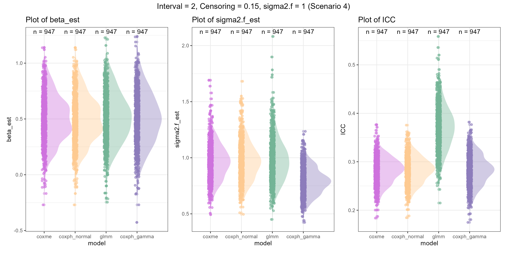

##### Affiliations: 
1) College of Forestry, Wildlife and Environment, Auburn University, Auburn, AL, USA
2) Evolution & Ecology Centre and School of Biological, Earth and Environmental Sciences, University of New South Wales, Sydney, New South Wales, Australia
3) School of Mathematics and Statistics, University of New South Wales, Sydney, New South Wales, Australia
4) Department of Biological Sciences, North Dakota State University, Fargo, North Dakota, USA
5) Institute for Ecology and Evolution, Friedrich Schiller University Jena, Jena, Thuringia, Germany
6) Department of Biological Sciences, University of Alberta, CW 405, Biological Sciences Building, Edmonton, Canada

*Corresponding author: kelseybmccune@gmail.com


```{r setup, include=FALSE}
knitr::opts_chunk$set(echo = TRUE)
```

# Background

In the manuscript, "Repeatability and intra-class correlations from time-to-event data: towards a standardized approach" we describe a method to quantify variances and intra-class correlations (repeatability) from time-to-event data. In this supplementary materials page we demonstrate the use of this method with real data in 3 worked examples. We additionally provide the data and code used in the case study section of the manuscript. Lastly, we present the methods and results for a simulation study to illustrate the relationship among model estimates (beta, random effect variance and intra-class correlation values) derived from 4 different models and implementations run on data simulated with varying random effect variance, time intervals, and amount of censored data.

# Worked Examples

Time-to-event data range widely in the number of individuals (or other cluster variable) as well as the number of repeated measures on each individual. Furthermore, the presence and amount of censored data can vary. We use openly available data to present 3 worked examples that vary in model parameters, sample sizes and amount of censoring. The first example involves models that do not include fixed effects, but include one random effect. In the second example, the models included 1 fixed effect and 1 random effect, while the third example involves 1 fixed effect and 2 random effects.

## Example 1: Frog aggression towards a simulated intruder

Our first example data set is from Peignier et al. 2022. They investigated whether *A. femoralis* frogs show repeatable aggressive behavior by measuring the latency of territorial males to approach a simulated intruder. Their sample size included 51 males with 3.2 $\pm$ 1.31 trials each. Censored data are present (6% of trials) because some males did not approach the simulated intruder. These individuals were given a ceiling value of 300 seconds (the longest trial time). To evaluate repeatability, the authors log-transformed this variable and used the Gaussian family in the rpt function (Stoffel et al. 2017).

In this first worked example, we give a high level of detail on the methods and model types described in the paper. In the subsequent examples, we present the data and run the analysis while elaborating less on the intermediary or alternative steps.

```{r E1 - load the data, echo=T}

# Data from Peignier et al. 2022
fdata = read.csv("https://raw.githubusercontent.com/kelseybmccune/Time-to-Event_Repeatability/main/data/Frog_personality.csv")
fdata = fdata[which(fdata$sex == "m"),c(1,2,9)] # Only males participated in the aggression test, we only need columns for ID, repetition and latency to approach the simulated intruder. Authors did not include fixed effects, so we won't either.
fdata = fdata[!is.na(fdata$jump_s),] # Unclear what the NAs represent, but the authors remove these data, so we will too.
fdata$event = ifelse(fdata$jump_s==300, 0,1) # Create event column that indicates whether the event occurred or data were censored for that trial.

head(fdata,10)
```

This is a classic (un-exploded) format for animal personality data. 

### ICC from the coxme function with the classic data set
We will first conduct a Cox proportional hazards model using the `coxme` package in R (Therneau, 2022). The `coxme` function is able to estimate multiple random effects, as well as random slopes. We included a random effect for individual identity as in Equation 3 of the main text, except that there are no fixed effects in this frog model. In this model specification, the response variable is a "survival" object that combines latency to jump ("jump_s") and the event indicator.

```{r E1 - coxme continuous model, echo = T}
library(coxme)
library(survival)
c1 = coxme(Surv(jump_s,event)~1+(1|ID), data = fdata)

var <- VarCorr(c1)$ID[[1]] # Random effect variance
var
```

We can now estimate the ICC using Equation 7 from the main text. Because of the equivalence of a mixed-effects Cox proportional hazards model with the binomial generalized linear mixed-effects model with the clog-log link, Equation 7 uses the random effect variance from the Cox model and the binomial GLMM distribution-specific residual variance estimator (Nakagawa et al. 2017).

```{r E1 - Parametric ICC calculation, echo = T}
var/(var + pi^2/6)
# Original paper reports a repeatabiltiy of 0.24 (CI: 0.07-0.40)

```

This yields an ICC value of 0.19.

We created two R functions to estimate the p-value and a confidence interval for time-to-event ICCs calculated using `coxme`.
```{r E1 - p-value and ci functions, echo = T}
# Define the function
# missing values ignored

#' @title comxe_pval
#' @description This function calculates the p-value of the effect of the random effect in a coxme model. It also provides the p-value of the effect of the random effect using a bootstrapped method.
#' @param model A coxme model object
#' @param data The original data used to fit the model
#' @param boot Number of simulations to run to produce 95 percent confidence intervals for I2. Default is \code{NULL}, where only the point estimate is provided. We recommend users choose between 1000 - 10000 simulations
#' @return A vector of p-values
#' @author Shinichi Nakagawa - s.nakagawa@unsw.edu.au
#' @author etc

coxme_pval <- function(model, data, boot = NULL) {
  # Get the original data
  
  if(all(class(model) %in% c("coxme")) == FALSE) {stop("Sorry, you need to fit a coxme model of class coxme")}
  
  # I think we need to use get the dimension of the data

  response <- as.data.frame(model$y[,1:2])
  
  fixed_formula <- as.formula(model$formulaList$fixed)
  
  # fit the model without any random effects
  fit <- survival::coxph(as.formula(fixed_formula), data = data)
  # loglikelihood ratio test
  # this is p value of effect of taking all random effects
  pval<- anova(fit, model)$P[-1]
  names(pval) <- "liklihood_ratio_test"
  
  if(!is.null(boot)){
  
  # we need to use replicate to create many vectors of these - randomize the data
  orders <- replicate(boot, sample(1:nrow(response)))  
  
  fixed_formula <- as.character(fixed_formula)  
  random_formula <-  as.vector(as.character(model$formulaList$random))        
  formula <- as.formula(paste("Surv(new_time, new_status)", 
                           "~", 
                           fixed_formula[3], 
                           "+",
                           paste(random_formula, collapse = "+")))
  data2 <- data

  # randomizaton/permutation tests
  pb <- progress::progress_bar$new(total = boot,
                                 format = "Bootstrapping [:bar] :percent ETA: :eta",
                                 show_after = 0)

  # loop
  num <- length(summary(model)$random$variance)

  store <- matrix(NA, nrow = num, ncol = boot)

  # Loop over the number of bootstraps
  for (i in 1:boot) {
  # Permute the data

  data2$new_time <- response$time[orders[ ,i]]
  data2$new_status <- response$status[orders[ ,i]]

  # Fit the original coxme model
  temp  <- tryCatch(coxme(formula, data = data2))

  # get variance component
   store[ ,i] <- summary(temp)$random$variance

   pb$tick()
   Sys.sleep(1 / boot)

    }
   
  # getting the p value
   pval2 <- sapply(1:num, function(x) {
     sum(store[x,] > summary(model)$random$variance[x])/boot}
     )
   
   names(pval2) <- paste(rep("bootstrapped_pval", num), 1:num, sep = "_")
  }

  if(exists("pval2")) {
    
  res <- c(pval, pval2)
  return(res)
  
  } else {
  res <- pval
  return(res)
  }

}


#' @title coxme_icc_ci
#' @description This function calculates the 95 percent confidence interval for the intraclass correlation from the `coxme` objects.
#' @param model A coxme model object
#' @param upper.multiplier The multiplier for the upper bound of the confidence interval. Default is 10 (adjust to a higer value if the upper bound is not reached).
#' @return A vector of the lower, point estimate, and upper bounds of the 95 percent confidence interval for the intraclass correlation
#' @author Shinichi Nakagawa - s.nakagawa@unsw.edu.au
#' @author etc

coxme_icc_ci <- function(model, upper.multiplier = 10) {
  if(all(class(model) %in% c("coxme")) == FALSE)
    {stop("Sorry, you need to fit a coxme model of class coxme")} 
  if(any(length(summary(model)$random$variance) > 1)) {stop("Sorry. At the moment, we can only have a model with one random effect.")}
  
  # Define a sequence of variance values``
  # the length of the response
  n <- nrow(model$y)
  cut = 100
  
  var_point <- summary(model)$random$variance
  
  # based on this pdf: https://cran.r-project.org/web/packages/coxme/vignettes/coxme.pdf
  # upper CI is limited to var_point*(10*log(n)) - so this could fail
  estvar1 <- seq(0.00000000000001, var_point, length = cut)
  estvar2 <- seq(var_point, var_point*upper.multiplier, length = cut+1)[-1]
  estvar <- c(estvar1, estvar2)
  
  # Initialize a vector to store the log-likelihood values
  loglik <- double(cut)
  
  # Loop over the variance values
  for (i in seq_len(cut*2)) {
    # Fit a coxme model with fixed variance
    tfit <- update(model, vfixed = estvar[i])
    
    # Compute the log-likelihood
    loglik[i] <- 2 * diff(tfit$loglik)[1]
  }
  
  # Compute the threshold for the 95% confidence interval
  temp <-  as.numeric(2 * diff(model$loglik)[1]) - loglik
  
  # Find the variance values that correspond to the threshold
  # getting lower and upper CI using profile likelihood
  lower <- approx(temp[1:(cut)], sqrt(estvar[1:(cut)]), qchisq(.95, 1))$y
  upper <- approx(temp[(cut + 1):(2*cut)], sqrt(estvar[(cut + 1):(2*cut)]), qchisq(.95, 1))$y
  
  # Return the 95% confidence interval
  ICC_lower <- lower^2 / (lower^2 + pi^2 / 6)
  if (is.na(ICC_lower)) {
    ICC_lower <- 0
  }
  ICC_point <- var_point / (var_point + pi^2 / 6)
  ICC_upper <- upper^2 / (upper^2 + pi^2 / 6)
  names(ICC_lower) <- "lower"
  names(ICC_point) <- "ICC"
  names(ICC_upper) <- "upper"
  
  return(c(ICC_lower, ICC_point, ICC_upper))
}


```


```{r E1 - Frog p-value and ci, echo = T}
coxme_pval(c1,fdata,boot=10000) # as there were no fixed effects in our model, the likelihood ratio test returns an NA value. Took 6 minutes with 10,000 simulations
coxme_icc_ci(c1, upper.multiplier = 10) # confidence interval and ICC estimate

```


### ICC from coxme with an exploded data set
To check the equivalence in time-to-event ICC values between Cox proportional hazards models and binomial GLMM, we need a data set that includes discrete time intervals. This is referred to as an "exploded" data set (see Fig. 1 in the main text) and we can use the function survSplit in the survival package (Therneau, 2024) to easily transform the data. In a simulation study (see below), we found no difference in model estimates or ICC values when we used 2 or 4 time intervals for the exploded data sets.

```{r E1 - explode the data, echo=T}
# decide on the intervals
psych::describe(fdata$jump_s) # max value = 300

fdata_int = survSplit(Surv(jump_s,event) ~ repetition+ID, data = fdata, 
                      cut = 150, start = "tstart",end = "tstop") # two time intervals

head(fdata_int,10)
```
In the exploded data set with two time intervals, for each individual and trial we have a time interval that ranges from 0 to 150 and 150 to 300 (the ceiling latency value for this data set). If the event occurs, the tstop value represents the time at which the frog approaches the speaker.


Now we can compare the Cox model output between the classic and the exploded data set. The response variable is again a "survival" object, but now combines the start and stop time of the interval and the event indicator.
```{r E1 - coxme interval model, echo = T}
c1_int = coxme(Surv(tstart,tstop,event)~1+(1|ID), data = fdata_int)

var <- VarCorr(c1_int)$ID[[1]]
var
```

You can see that the variance estimate for the random effect is the same in both Cox models.


In Equation 5 of the main text we show the calculation for the non-parametric version of the ICC, Kendall's tau, which assumes a Gamma distribution of the random effect. In addition to being non-parametric, another limitation is that it is not feasible to estimate the non-parametric ICC when there are more than one random effects. We wrote a function to obtain the non-parametric ICC numerically:

```{r E1 - Non-parametric ICC function, echo = T}
# function obtained from
# https://github.com/cran/parfm/blob/master/R/frailtydistros.R

g <- function(w, k, s, sigma2) {
  -k * w + exp(w) * s + w ^ 2 /  (2 * sigma2)
}

g1 <- function(w, k, s, sigma2) {
  -k + exp(w) * s + w / sigma2
}

g2 <- function(w, k, s, sigma2) {
  exp(w) * s + 1 / sigma2    
} 

Lapl <- Vectorize(function(s, k, sigma2) {
  # Find wTilde = max(g(w)) so that g'(wTilde; k, s, theta) = 0
  WARN <- getOption("warn")
  options(warn = -1)
  wTilde <- optimize(f = g, c(-1e10, 1e10), maximum = FALSE,
                     k = k, s = s, sigma2 = sigma2)$minimum
  options(warn = WARN)
  
  # Approximate the integral via Laplacian method
  res <- (-1) ^ k * 
    exp(-g(w = wTilde, k = k, s = s, sigma2 = sigma2)) /
    sqrt(sigma2 * g2(w = wTilde, k = k, s = s, sigma2 = sigma2))
  return(res)
}, 's')

intTau <- Vectorize(function(x, intTau.sigma2=sigma2) {
  res <- x * 
    Lapl(s = x, k = 0, sigma2 = intTau.sigma2) *
    Lapl(s = x, k = 2, sigma2 = intTau.sigma2)
  return(res)
}, "x")

fr.lognormal <- function(k,
                         s,
                         sigma2,
                         what = "logLT") {
  # if (!(is.numeric(sigma2) && (sigma2 > 0)))
  # stop("The parameter sigma2 is not a positive value.")
  
  if (what == "logLT") {
    # if (!(is.numeric(s) && (s > 0)))
    #     stop("The parameter s is not positive.")
    # Find wTilde = max(g(w)) so that g'(wTilde; k, s, theta) = 0
    WARN <- getOption("warn")
    options(warn = -1)
    wTilde <- nlm(f = g, p = 0, k = k, s = s, sigma2 = sigma2)$estimate
    options(warn = WARN)
    
    # Approximate the integral via Laplacian method
    res <- -g(w = wTilde, k = k, s = s, sigma2 = sigma2) -
      log(sigma2 * g2(w = wTilde, k = k, s = s, sigma2 = sigma2)
      ) / 2
    return(res)
  }
  else if (what == "tau") {
    intTau <- Vectorize(function(x, intTau.sigma2=sigma2) {
      res <- x * 
        Lapl(s = x, k = 0, sigma2 = intTau.sigma2) *
        Lapl(s = x, k = 2, sigma2 = intTau.sigma2)
      return(res)
    }, "x")
    
    tauRes <- 4 * integrate(
      f = intTau, lower = 0, upper = Inf, 
      intTau.sigma2 = sigma2)$value - 1
    return(tauRes)
  }
}

```

```{r E1 - Non-parametric ICC estimate, echo=T, warning=FALSE}
c1_ph = coxph(Surv(jump_s, event)~1 + frailty(ID, distribution="gamma"), data=fdata)
var <- as.numeric(c1_ph$history$`frailty(ID, distribution = "gamma")`[1]) # Random effect variance is close to that from coxme

fr.lognormal(k,s,var,what = "tau") # non-parametric ICC estimate
```
The non-parametric ICC ($ICC_{np}$) estimate for these frog data is 0.14.


### ICC from binomial GLMM with the exploded data set
We now demonstrate the use of the binomial GLMM to analyze the exploded survival data. However, we also need to include a column as an identifier of the time interval to include as a fixed effect, which takes the place of the start and stop time from the Cox models.

```{r E1 - binomial GLMM, echo=TRUE, warning=FALSE}
# we previously told the survSplit function to create 2 intervals by splitting the latency values at 150.
# create column to identify intervals
fdata_int$interval = NA
fdata_int$interval =  ifelse(fdata_int$tstart == 0,1,2)

# Run the binomial glmm model
library(lme4)
b1 <- glmer(event ~ as.factor(interval) + (1|ID), data=fdata_int,
                 family = binomial(link="cloglog"), nAGQ=7)
var <- b1@theta^2 # extract the random effect variance from the model output object
var/(var + pi^2/6)

```

The random effect variance from the binomial GLMM is 0.24, and the ICC value using Equation 7 is 0.13.


## Example 2: Christmas tree worm re-emergence after a simulated predator attack

Our next example data come from Pezner et al. 2017 <https://academic.oup.com/beheco/article/28/1/154/2453511>. They tested the consistency of hiding time (latency to re-emerge from the hole) within and across days, and the impact of the social environment. They tested 30 worms, each received 4 trials within a day and 4 days of sampling for a total of 16 trials per worm. Censored data are not explicitly stated, but there are 5 NA values from 2 individuals that we here assume are censored data (~1% of data). In the original paper, the authors log-transformed the hiding time variable, used a linear mixed model to get variance estimates, then hand-calculated repeatability.

```{r E2, echo=TRUE, warning=FALSE}
## Load the data
ctw = read.csv("https://raw.githubusercontent.com/kelseybmccune/Time-to-Event_Repeatability/main/data/CTWemergence.csv")
# "HT" variable indicates hiding time, or the latency to emerge; "Whorls" is a visual indicator of age

# 2 individuals have NA values, but it is not explained why. 
# For this worked example, we assume these are censored (the worm didn't emerge in the trial time) and give ceiling value of one unit after the highest value
ctw$event = ifelse(is.na(ctw$HT),0,1) # create the event column
ctw$HT[which(is.na(ctw$HT))]<- 375 # identify ceiling values

## Coxme with classic data
ctw.cox = coxme(Surv(HT, event) ~ Whorls + (1|Worm_ID), data = ctw)
cox.zph(ctw.cox) # Whorls does change with time, violating the proportional hazards assumption

# use functions for ICC, confidence interval and p-value
coxme_icc_ci(ctw.cox, upper.multiplier = 10) 
coxme_pval(ctw.cox,ctw,boot=10000) # Took 17 minutes to run with 10,000 simulations


## Coxme with exploded data
# decide on the intervals
psych::describe(ctw$HT)
ctw_int = survSplit(Surv(HT,event) ~ Whorls + Trial_Total + Worm_ID, data = ctw, 
                    cut = c(94,188,282), start = "tstart",end = "tstop") # 4 time intervals

ctw.cox.int = coxme(Surv(tstart,tstop, event)~Whorls + (1|Worm_ID), data=ctw_int)

var <- VarCorr(ctw.cox.int)$Worm_ID[[1]]
var/(var + pi^2/6)
# Original paper finds that the across-day hiding time repeatability was 0.42


## Binomial glmm model with exploded data 
ctw_int$interval = NA
ctw_int$interval = ifelse(ctw_int$tstart == 0,1,ctw_int$interval)
ctw_int$interval = ifelse(ctw_int$tstart == 94,2,ctw_int$interval)
ctw_int$interval = ifelse(ctw_int$tstart == 188,3,ctw_int$interval)
ctw_int$interval[which(is.na(ctw_int$interval))]<-4

b2 <- glmer(event ~ as.factor(interval) + Whorls + (1|Worm_ID), data=ctw_int,
                 family = binomial(link="cloglog"), nAGQ=7)
var <- b2@theta^2 # extract the random effect variance from the model output object
var/(var + pi^2/6)
```


## Example 3: Repeatability of distance to cache a seed in smalll mammals

Brehm et al. 2019 (<https://onlinelibrary.wiley.com/doi/full/10.1111/ele.13324>) evaluated seed caching behavior in relation to multiple personality traits and habitat characteristics. They offered artificial seeds to several species of small mammals that had reflective flags attached so that, if the individual cached the seed, it could be relocated and the distance from the food platform could be measured. The data include 17 short-tailed shrews, 47 red-backed voles and 46 unique deer mice that cached between 1-14 seeds (mean ± se = 3.9 ± 0.73). Understandably, it can be hard to relocate the cached seeds and so 52% of the caching distances were censored (seeds lost to follow up). For our worked example, we considered the repeatability of caching distance as a function of the fixed effect of silviculture (habitat) treatment, and random effects for individual ID and for species. The original paper did not run this particular analysis.

```{r E3, echo=TRUE, warning=FALSE}
## Load the data
data<-read.csv("https://raw.githubusercontent.com/kelseybmccune/Time-to-Event_Repeatability/main/data/data_seed_pers.csv")

distmov<-data[-which(is.na(data$RECOVERED..Y.N.)),] # distance the seed is dispersed, only looking at seeds that were removed from the feeding platform
distmov<-subset(distmov, CONS!=1 & REMOVE==1) # remove rows where the seed was consumed close by the feeding platform


dist = distmov[-which(distmov$DIST..MOVED == 0),c(1,3,5,14,17)] #simplify data frame
# the Recovered column is analogous to the event variable in survival analysis. Modify it to be an integer
dist$event = ifelse(dist$RECOVERED..Y.N.== "Y",1,0)
dist$DIST..MOVED[which(dist$RECOVERED..Y.N. == "N")]<-1038 # give ceiling value to NAs
dist = dist[-which(is.na(dist$DIST..MOVED)),] # Remove rows where seeds are indicated as recovered, but no distance was listed
table(dist$RECOVERED..Y.N.) # how many cached seeds did they recover (i.e., how much censored data is there?)
# 52% of data are censored

## Coxme with classic data set structure
dist.cox = coxme(Surv(DIST..MOVED, event) ~ TRT + (1|ID) + (1|SPP), data=dist)
cox.zph(dist.cox) # Fixed effect does not violate proportional hazard assumption

var <- VarCorr(dist.cox)$ID[[1]] 
var/(var + pi^2/6) 
var2 <- VarCorr(dist.cox)$SPP[[1]] 
var2/(var2 + pi^2/6) 

coxme_pval(dist.cox,dist,boot=10000) # bootstrapping: ID p-value < 0.01; SPP p-value < 0.01 
# likelihood ratio test compares the increase in variance explained by the addition of the random effects over the base model with just a fixed effect.
# Took 22 minutes to run with 10,000 simulations
#coxme_icc_ci(dist.cox) # currently this function only works with one random effect


## Explode the data
# Create intervals
psych::describe(dist$DIST..MOVED)

dist_int = survSplit(Surv(DIST..MOVED, event) ~ TRT + ID + SPP, data = dist, 
                     cut = c(346,692), start = "tstart",end = "tstop",zero=0)

## Cox model and ICC calculation
dist.cox.int = coxme(Surv(tstart,tstop, event) ~ TRT + (1|ID) + (1|SPP), data=dist_int)
var <- VarCorr(dist.cox.int)$ID[[1]]
var/(var + pi^2/6) 
var2 <- VarCorr(dist.cox.int)$SPP[[1]] 
var2/(var2 + pi^2/6) 

## Binomial glmm model with exploded data 
dist_int$interval = NA
dist_int$interval = ifelse(dist_int$tstart == 0,1,dist_int$interval)
dist_int$interval = ifelse(dist_int$tstart == 346,2,dist_int$interval)
dist_int$interval = ifelse(dist_int$tstart == 692,3,dist_int$interval)

b3 <- glmer(event ~ as.factor(interval) + TRT + (1|ID) + (1|SPP), data=dist_int,
                 family = binomial(link="cloglog"))
var <- b3@theta[[1]]^2 # extract the random effect variance from the model output object
var/(var + pi^2/6) # ICC for ID
var2 <- b3@theta[[2]]^2 # extract the random effect variance from the model output object
var2/(var2 + pi^2/6) # ICC for SPP

```


# Data and code for Case Study in the main text
From McCune et al. 2019.
```{r Case Study, echo=TRUE, warning=FALSE}

#Latency to solve a door on a puzzle box
jsolv = read.csv("https://raw.githubusercontent.com/kelseybmccune/Time-to-Event_Repeatability/main/data/jaySolveData.csv")
jsolv = jsolv[,c(2:6,9)]
colnames(jsolv)[6] = "Time"

solv.su = coxme(Surv(Time, Solve)~Treatment + (1|ID), data=jsolv)
cox.zph(solv.su) # fixed effect does not violate the proportional hazards assumption
coxme_pval(solv.su,jsolv,boot = 10000) # takes about 6 minutes to run
coxme_icc_ci(solv.su) # adjusted ICC

solv.su2 = coxme(Surv(Time,Solve) ~ 1 + (1|ID), data = jsolv)
coxme_pval(solv.su2,jsolv,boot = 10000) # 6 minutes to run, again; no fixed effect so likelihood ratio test is NA
coxme_icc_ci(solv.su2) # unadjusted ICC

```

# Simulations

We conducted a small simulation study to examine whether model estimates are consistent across four different models and implementations: (1) a Cox proportional hazards model with a normal distribution of the random effect using the `coxme` function from the `coxme` package, (2) a Cox proportional hazards frailty model with a normal distribution of the random effect using `coxph` from the `survival` package, (3) a Cox proportional hazards frailty model with a gamma distribution of the random effect using `coxph` from the `survival` package, and (4) a binomial generalized linear mixed-effects model with a clog-log link using the `glmer` function from the `lme4` package. The models (1), (2) and (3) are described in Equation 3 and model (4) is described in Equation 7 in the main text.

Time-to-event data were simulated with a single predictor variable (sex) and a single random effect (i.e. cluster or individual) $\alpha$, as described in the main text. We considered $n=1000$ observations and $n_{cluster}=100$ clusters (i.e. individuals). To evaluate performance of the above models, we simulated different data sets where we varied the magnitude of the random effect variance ($\sigma^2_\alpha$) from 1 to 3, the percent of censored data was either 0 or 0.15, and the number of time intervals was either 2 or 4. We ran each model on each data set 1000 times. We excluded results if at least one of the models did not converge or had a convergence warning message.

We present illustrative plots comparing model performance when the random effect variance is set to 1 or 2, censoring = 0.15 and time intervals = 2 or 4. These simulations had the least convergence problems or warnings out of the 1000 iterations. 

Examining the model performance within each plot, we found that the beta estimates of the predictor variable ($\beta_{\text{est}}$) are identical and relatively unbiased across all models. The variance estimates of the random effect ($\sigma^2_{f_{\text{est}}}$) are very similar for the `coxme`, `coxph`, and `glmm` models, while the `coxph_gamma` model consistently underestimates this variance. Additionally, the intra-class correlation coefficient (ICC) is consistently higher in the `glmm` model compared to the `coxme` and `coxph` models. This aligns with Figure 2 in the main text, which shows that as the variance of the random effect increases, the $ICC$ value from the GLMM model becomes proportionally larger than the non-parametric value ($ICC_{np}$) from the Cox models. Furthermore, comparing performance across plots demonstrates that the number of time intervals in the data (2 or 4) has no effect on the model estimates. 




Note that 'sigma2.f' refers to the random effect variance.

The simulation study was conducted with R (R Core Team, 2024) and using the computational cluster Katana at UNSW Sydney (UNSW, 2024).

# References

Bates, D., Maechler, M., Bolker, B., & Walker, S. (2015). Fitting linear mixed-effects models using lme4. *Journal of Statistical Software, 67*(1), 1-48. <https://doi.org/10.18637/jss.v067.i01>

Brehm, A. M., Mortelliti, A., Maynard, G. A., & Zydlewski, J. (2019). Land‐use change and the ecological consequences of personality in small mammals. Ecology Letters, 22(9), 1387-1395. <https://doi.org/10.1111/ele.13324>

McCune, K.B., Jablonski, P.G., Lee, S., Ha, R.R., 2019. Captive jays exhibit reduced problem-solving performance compared to wild conspecifics. Royal Society Open Science 6, 181311. <https://doi.org/10.1098/rsos.181311>

Nakagawa, S., Johnson, P.C.D., Schielzeth, H., 2017. The coefficient of determination R2 and intra-class correlation coefficient from generalized linear mixed-effects models revisited and expanded. Journal of the Royal Society Interface 14. <https://doi.org/10.1098/rsif.2017.0213>

Peignier, M., Araya-Ajoy, Y.G., Bégué, L. et al. Exploring links between personality traits and their social and non-social environments in wild poison frogs. Behav Ecol Sociobiol 76, 93 (2022). <https://doi.org/10.1007/s00265-022-03202-9>

Pezner, A. K., Lim, A. R., Kang, J. J., Armenta, T. C., & Blumstein, D. T. (2016). Hiding behavior in Christmas tree worms on different time scales. Behavioral Ecology, 28(1), 154–163. <https://doi.org/10.1093/beheco/arw140>

R Core Team. (2024). *R: A language and environment for statistical computing*. R Foundation for Statistical Computing. <https://www.R-project.org/>

Therneau, T. M. (2024). *A package for survival analysis in R* (R package version 3.5-8). <https://CRAN.R-project.org/package=survival>

Therneau, T. M. (2024). *coxme: Mixed effects Cox models* (R package version 2.2-20). <https://CRAN.R-project.org/package=coxme>

Therneau, T. M., & Grambsch, P. M. (2000). *Modeling survival data: Extending the Cox model*. Springer. ISBN 0-387-98784-3
